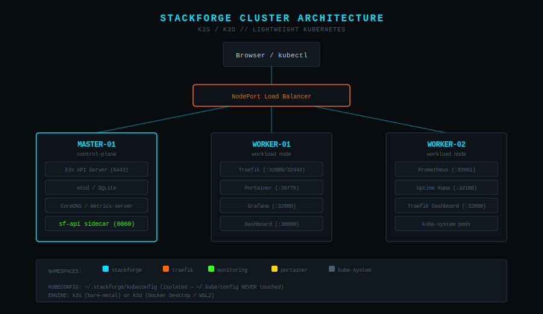
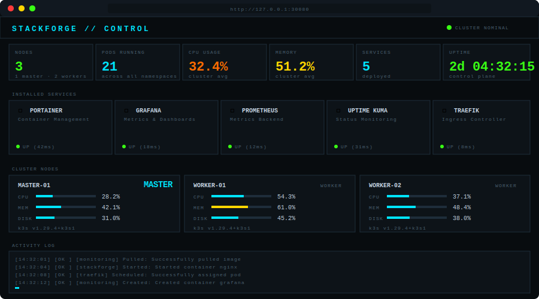

# STACKFORGE

> A guided homelab infrastructure bootstrapper. One script. Real monitoring. Choose your adventure.

```
  ███████╗████████╗ █████╗  ██████╗██╗  ██╗███████╗ ██████╗ ██████╗  ██████╗ ███████╗
  ██╔════╝╚══██╔══╝██╔══██╗██╔════╝██║ ██╔╝██╔════╝██╔═══██╗██╔══██╗██╔════╝ ██╔════╝
  ███████╗   ██║   ███████║██║     █████╔╝ █████╗  ██║   ██║██████╔╝██║  ███╗█████╗
  ╚════██║   ██║   ██╔══██║██║     ██╔═██╗ ██╔══╝  ██║   ██║██╔══██╗██║   ██║██╔══╝
  ███████║   ██║   ██║  ██║╚██████╗██║  ██╗██║     ╚██████╔╝██║  ██║╚██████╔╝███████╗
  ╚══════╝   ╚═╝   ╚═╝  ╚═╝ ╚═════╝╚═╝  ╚═╝╚═╝      ╚═════╝ ╚═╝  ╚═╝ ╚═════╝ ╚══════╝
```

[](LICENSE)
[]()
[](https://k3s.io)
[](https://github.com/ry-ops/stackforge/pkgs/container/stackforge)
[]()

---

## What You Get

<p align="center">
  
</p>

A production-style Kubernetes cluster with real-time monitoring — running on your hardware or Docker Desktop. Every component is optional. You choose what gets installed.

| Phase | Component | What it does |
|-------|-----------|--------------|
| Foundation | Docker + k3s/k3d | Container runtime and lightweight Kubernetes |
| Ingress | Traefik | Ingress controller with dashboard on `:32090` |
| Management | Portainer CE | GUI for your cluster and containers |
| Observability | Prometheus + Grafana | Full metrics stack with pre-built k8s dashboards |
| Observability | Uptime Kuma | Service health monitoring |
| Portal | Stackforge Dashboard | Real-time monitoring portal with live metrics |
| Sidecar | sf-api | Go API server for real cluster data (CPU, memory, pods, events) |

---

## Dashboard Preview

<p align="center">
  
</p>

The dashboard shows **real data** from your cluster — not simulations. CPU/memory from metrics-server, pod counts, service health checks (with latency), Kubernetes events, and one-click deployment restarts.

---

## 30-Second Quickstart

```bash
git clone https://github.com/ry-ops/stackforge
cd stackforge
bash stackforge.sh
```

That's it. The script detects your environment and walks you through every step.

> **Docker Desktop users:** Just run `bash stackforge.sh` — it auto-detects macOS/WSL2 and uses k3d. No root needed.

---

## Install Flow

<p align="center">
  
</p>

---

## Platform Support

### Linux (bare-metal k3s)

| OS Family | Distros |
|-----------|---------|
| Debian/Ubuntu | Ubuntu 20.04+, Debian 11+, Raspberry Pi OS, Linux Mint, Pop!_OS |
| RHEL | RHEL 8+, CentOS Stream 8+, Rocky Linux 8+, AlmaLinux 8+, Oracle Linux |
| Fedora | Fedora 38+ |
| openSUSE | Leap 15+, SLES |
| Arch | Arch Linux, Manjaro, EndeavourOS |
| Alpine | Alpine 3.18+ |

### Docker Desktop (k3d)

| Platform | Requirement |
|----------|-------------|
| macOS | Docker Desktop installed and running |
| Windows | Docker Desktop + WSL2 |

**Architectures:** `x86_64`, `arm64/aarch64`, `armv7l`

---

## Port Reference

| Service | NodePort | Protocol |
|---------|----------|----------|
| Stackforge Dashboard | 30080 | HTTP |
| Portainer | 30777 / 30779 | HTTP / HTTPS |
| Traefik HTTP | 32080 | HTTP |
| Traefik HTTPS | 32443 | HTTPS |
| **Traefik Dashboard** | **32090** | **HTTP** |
| Grafana | 32000 | HTTP |
| Prometheus | 32001 | HTTP |
| Uptime Kuma | 32100 | HTTP |

On Docker Desktop / WSL2, these map to `127.0.0.1`. On bare-metal, they map to the node's LAN IP.

---

## Default Credentials

| Service | Username | Password | Notes |
|---------|----------|----------|-------|
| Grafana | `admin` | Random (shown at install) | Stored in `~/.stackforge/state.env` |
| Portainer | `admin` | Random (shown at install) | Stored in `~/.stackforge/state.env` |
| Traefik Dashboard | — | — | No auth (local access only) |
| Uptime Kuma | — | — | Set up on first visit |

> Passwords are randomly generated at install time and displayed in the terminal. View them later with `cat ~/.stackforge/state.env`, change them via the dashboard UI, or reset all with `bash stackforge.sh --reset-passwords`. See the [credential management docs](docs/getting-started.md#managing-credentials) for details.

---

## After Install

> **New to stackforge?** Read the full **[Getting Started Guide](docs/getting-started.md)** — covers Uptime Kuma setup, adding nodes, monitoring devices, and more.

### Access your cluster

stackforge **never** touches `~/.kube/config`. All access uses:

```bash
# One-off command
KUBECONFIG=~/.stackforge/kubeconfig kubectl get nodes

# Alias (add to ~/.bashrc or ~/.zshrc)
alias sfk='KUBECONFIG=~/.stackforge/kubeconfig kubectl'

# Print kubeconfig path
bash stackforge.sh --kubeconfig
```

### Add worker nodes (bare-metal only)

```bash
bash stackforge.sh --worker
```

See the [Getting Started Guide](docs/getting-started.md#adding-worker-nodes) for detailed instructions on joining worker nodes.

### Set up Uptime Kuma monitors

After install, open Uptime Kuma at `http://localhost:32100`, create an admin account, and add monitors for your services. See the [full setup guide](docs/getting-started.md#setting-up-uptime-kuma).

### Re-run to add services

```bash
bash stackforge.sh
# Detects existing installs and skips them
```

### Tear down

```bash
bash stackforge.sh --destroy
# Safe — never touches ~/.kube/config or other clusters
```

---

## Troubleshooting

### Portainer shows "Admin timeout" or "Initial setup expired"

Stackforge auto-sets the admin password via the Portainer API during install. If the API call failed:

```bash
# Delete and redeploy Portainer
KUBECONFIG=~/.stackforge/kubeconfig helm uninstall portainer -n portainer
bash stackforge.sh   # Re-run — it will reinstall Portainer
```

### Traefik Dashboard returns 404

Fixed in v0.4.0. The dashboard now runs on port **32090** (not 32080). The Traefik internal dashboard entrypoint (port 9000) is properly exposed.

### Prometheus not accessible

Fixed in v0.4.0. The Helm value path for the Prometheus NodePort was corrected.

### Dashboard shows "API OFFLINE"

The sf-api sidecar needs a few seconds to start. Refresh after 10-15 seconds. If it persists, check the sidecar logs:

```bash
KUBECONFIG=~/.stackforge/kubeconfig kubectl logs -n stackforge \
  $(KUBECONFIG=~/.stackforge/kubeconfig kubectl get pod -n stackforge -l app=stackforge-dashboard -o name) \
  -c sf-api
```

---

## FAQ

**Q: Will this break my existing Kubernetes cluster?**
No. stackforge uses its own kubeconfig at `~/.stackforge/kubeconfig` and never reads or writes `~/.kube/config`.

**Q: Do I need Linux?**
No. Docker Desktop on macOS or Windows/WSL2 works. stackforge uses k3d (k3s-in-Docker) automatically.

**Q: Can I run this on a Raspberry Pi?**
Yes. arm64 and armv7l are supported. Use bare-metal mode with Raspberry Pi OS.

**Q: How much RAM do I need?**
Minimum 4GB. Recommended 8GB+ for all services.

**Q: Is the dashboard data real?**
Yes. v0.4.0 includes a Go sidecar (sf-api) that queries the Kubernetes API and metrics-server for real CPU, memory, pod counts, events, and service health.

**Q: Can I add my own services to the dashboard?**
Yes. Click "+ ADD" in the dashboard to add custom service cards. They persist in localStorage.

---

## Repo Structure

```
stackforge/
├── stackforge.sh                  # Main installer script
├── Dockerfile                     # Container image (stackforge)
├── sidecar/
│   ├── main.go                    # Go API server (sf-api)
│   ├── Dockerfile                 # Multi-stage Go build
│   ├── go.mod / go.sum            # Dependencies
├── .github/workflows/             # CI/CD (Docker publish)
├── manifests/
│   ├── dashboard/
│   │   └── dashboard.yaml         # nginx + sf-api sidecar + RBAC
│   └── uptime-kuma/
│       └── uptime-kuma.yaml       # Deployment + PVC + NodePort
├── dashboard/
│   └── index.html                 # Real-time monitoring portal
├── docs/
│   ├── getting-started.md         # New user guide (Uptime Kuma, nodes, devices)
│   ├── architecture.svg           # Cluster topology diagram
│   ├── dashboard-preview.svg      # Dashboard mockup
│   └── install-flow.svg           # Animated install terminal
└── README.md
```

---

## Philosophy

- **Guided, not scripted** — every decision is yours, explained in plain language
- **Lightweight first** — k3s over kubeadm, NodePort over LoadBalancer, single binary where possible
- **Idempotent** — safe to re-run, skips what's already installed
- **Isolated** — uses its own kubeconfig, never touches existing clusters
- **Cross-platform** — bare-metal Linux, Docker Desktop on macOS, WSL2 on Windows
- **Observable from minute one** — real metrics, not simulations

---

## Companion Tutorial

Full walkthrough on ry-ops.dev: COMING SOON!!

---

## Contributing

PRs welcome. Open issues for distro support requests, new tool additions, or bug reports.

---

## License

MIT © [ry-ops](https://github.com/ry-ops)
