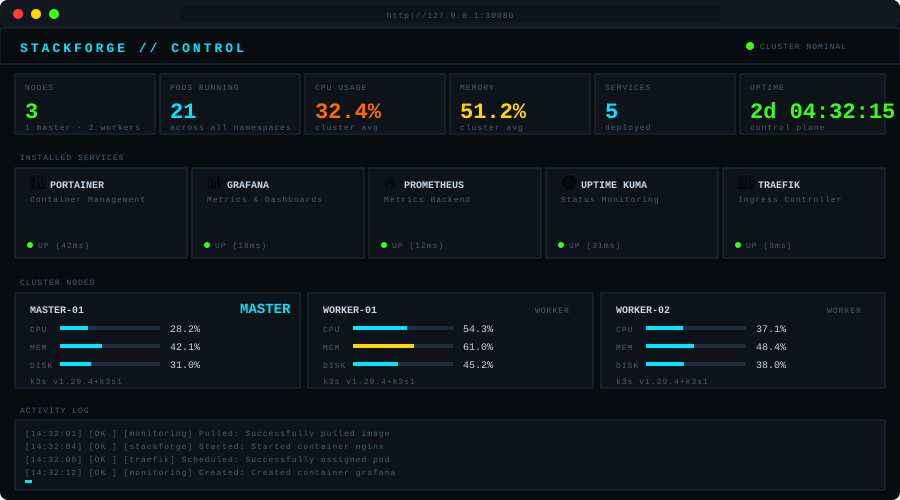

<p align="center">
  
</p>

<h1 align="center">STACKFORGE</h1>

<p align="center"><b>A guided homelab infrastructure bootstrapper.</b> One script. Real monitoring. Choose your adventure — k3s on bare-metal, or k3d on Docker Desktop.</p>

```
  ███████╗████████╗ █████╗  ██████╗██╗  ██╗███████╗ ██████╗ ██████╗  ██████╗ ███████╗
  ██╔════╝╚══██╔══╝██╔══██╗██╔════╝██║ ██╔╝██╔════╝██╔═══██╗██╔══██╗██╔════╝ ██╔════╝
  ███████╗   ██║   ███████║██║     █████╔╝ █████╗  ██║   ██║██████╔╝██║  ███╗█████╗
  ╚════██║   ██║   ██╔══██║██║     ██╔═██╗ ██╔══╝  ██║   ██║██╔══██╗██║   ██║██╔══╝
  ███████║   ██║   ██║  ██║╚██████╗██║  ██╗██║     ╚██████╔╝██║  ██║╚██████╔╝███████╗
  ╚══════╝   ╚═╝   ╚═╝  ╚═╝ ╚═════╝╚═╝  ╚═╝╚═╝      ╚═════╝ ╚═╝  ╚═╝ ╚═════╝ ╚══════╝
```

<p align="center">
  <a href="LICENSE"></a>
  
  <a href="https://k3s.io"></a>
  <a href="https://github.com/ry-ops/stackforge/pkgs/container/stackforge"></a>
  
</p>

---

## 30-second quickstart

```bash
git clone https://github.com/ry-ops/stackforge
cd stackforge
bash stackforge.sh
```

That's it. The script detects your environment and walks you through every step. **Docker Desktop users** (macOS / WSL2) — same command; it auto-detects and uses k3d, no root needed.

## What you get

<p align="center">
  
</p>

A production-style Kubernetes cluster with real-time monitoring — on your hardware or Docker Desktop. **Every component is optional; you choose what gets installed.**

## Dashboard

<p align="center">
  
</p>

The dashboard shows **real data** from your cluster — not simulations. CPU/memory from metrics-server, pod counts, service health checks (with latency), Kubernetes events, and one-click deployment restarts, all served by a Go sidecar (`sf-api`) that queries the Kubernetes API.

## Platform support

**Bare-metal k3s (Linux):** Ubuntu 20.04+, Debian 11+, Raspberry Pi OS, Mint, Pop!_OS · RHEL 8+ / CentOS Stream / Rocky / AlmaLinux / Oracle · Fedora 38+ · openSUSE Leap 15+/SLES · Arch / Manjaro / EndeavourOS · Alpine 3.18+.
**Docker Desktop k3d:** macOS, or Windows + WSL2.
**Architectures:** `x86_64`, `arm64/aarch64`, `armv7l` (yes, Raspberry Pi).

## Port reference

| Service | NodePort | | Service | NodePort |
|---|---|---|---|---|
| Stackforge Dashboard | `30080` | | **Traefik Dashboard** | **`32090`** |
| Portainer | `30777` / `30779` | | Grafana | `32000` |
| Traefik HTTP / HTTPS | `32080` / `32443` | | Prometheus | `32001` |
| Uptime Kuma | `32100` | | | |

On Docker Desktop / WSL2 these map to `127.0.0.1`; on bare-metal, to the node's LAN IP.

## After install

stackforge **never** touches `~/.kube/config` — all access uses its own kubeconfig:

```bash
KUBECONFIG=~/.stackforge/kubeconfig kubectl get nodes
alias sfk='KUBECONFIG=~/.stackforge/kubeconfig kubectl'   # handy alias

bash stackforge.sh --worker            # add worker nodes (bare-metal)
bash stackforge.sh                      # re-run: skips what's already installed
bash stackforge.sh --destroy           # tear down (never touches other clusters)
bash stackforge.sh --reset-passwords   # rotate generated credentials
```

Grafana and Portainer passwords are randomly generated at install and shown in the terminal (stored in `~/.stackforge/state.env`). See the **[Getting Started Guide](docs/getting-started.md)** for Uptime Kuma setup, adding nodes, and monitoring devices.

## Philosophy

- **Guided, not scripted** — every decision is yours, explained in plain language.
- **Lightweight first** — k3s over kubeadm, NodePort over LoadBalancer.
- **Idempotent** — safe to re-run; skips what's already installed.
- **Isolated** — its own kubeconfig, never touches existing clusters.
- **Cross-platform** — bare-metal Linux, Docker Desktop on macOS, WSL2 on Windows.
- **Observable from minute one** — real metrics, not simulations.

## Troubleshooting & FAQ

Common fixes (Portainer admin timeout, Traefik 404, dashboard "API OFFLINE") and FAQs (existing clusters, RAM needs, Raspberry Pi) are in the sections below and the [Getting Started Guide](docs/getting-started.md). The short version: it won't break your existing cluster (separate kubeconfig), needs 4GB RAM minimum (8GB+ recommended), and the dashboard data is real.

## Repo structure

```
stackforge.sh                  # the installer
sidecar/main.go                # Go API server (sf-api) — real cluster data
manifests/                     # dashboard (nginx + sf-api + RBAC), uptime-kuma
dashboard/index.html           # real-time monitoring portal
extension/                     # Docker Desktop extension
docs/                          # getting-started + diagrams
```

## License

MIT © [ry-ops](https://github.com/ry-ops)

<!-- org-footer -->
---

<p align="center"><sub>Part of <a href="https://github.com/ry-ops">ry-ops</a> · building the pipes between infrastructure, automation, and observability · built by <a href="https://github.com/ry-ops">ry-ops</a></sub></p>
